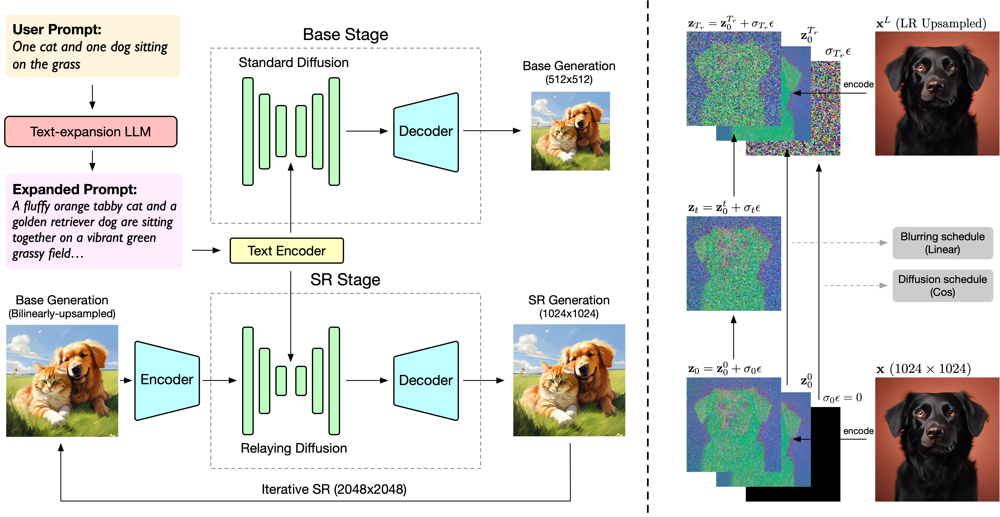
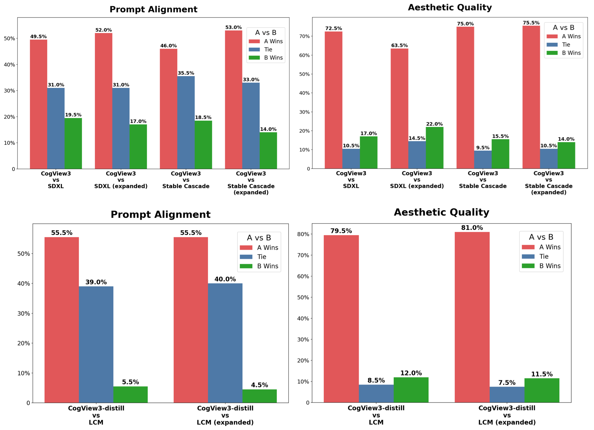

# CogView3 & CogView-3Plus

[Read this in English](./README_zh.md)

<div align="center">

</div>
<p align="center">
在 <a href="https://huggingface.co/spaces/THUDM-HF-SPACE/CogView3-Plus-3B-Space" target="_blank"> 🤗 Huggingface Space</a> 在线体验 CogView3-Plus-3B 模型
</p>
<p align="center">
📚 查看 <a href="https://arxiv.org/abs/2403.05121" target="_blank">论文</a>
</p>
<p align="center">
    👋 加入我们的 <a href="resources/WECHAT.md" target="_blank">微信</a>
</p>
<p align="center">
📍 前往<a href="https://chatglm.cn/main/gdetail/65a232c082ff90a2ad2f15e2?fr=osm_cogvideox&lang=zh"> 清言 </a> 和 <a href="https://open.bigmodel.cn/?utm_campaign=open&_channel_track_key=OWTVNma9"> API平台</a> 体验更大规模的商业版视频生成模型。
</p>

## 项目更新

- 🔥🔥 ```2024/10/13```: 我们适配和开源了 [diffusers](https://github.com/huggingface/diffusers) 版本的  **CogView-3Plus-3B**
  模型。你可以前往[在线体验](https://huggingface.co/spaces/THUDM-HF-SPACE/CogView3-Plus-3B-Space)。
- 🔥 ```2024/9/29```: 我们已经开源了 **CogView3**  以及 **CogView-3Plus-3B** 。**CogView3** 是一个基于级联扩散的文本生成图像系统，采用了接力扩散框架。
  **CogView-3Plus** 是一系列新开发的基 Diffusion Transformer 的文本生成图像模型。

## 模型介绍

CogView-3-Plus 在 CogView3（ECCV'24） 的基础上引入了最新的 DiT 框架，以实现整体性能的进一步提升。CogView-3-Plus 采用了
Zero-SNR
扩散噪声调度，并引入了文本-图像联合注意力机制。与常用的 MMDiT 结构相比，它在保持模型基本能力的同时，有效降低了训练和推理成本。CogView-3Plus
使用潜在维度为 16 的 VAE。

下表显示了我们目前提供的文本生成图像模型列表及其基础信息。

<table style="border-collapse: collapse; width: 100%;">
  <tr>
    <th style="text-align: center;">模型名称</th>
    <th style="text-align: center;">CogView3-Base-3B</th>
    <th style="text-align: center;">CogView3-Base-3B-distill</th>
    <th style="text-align: center;">CogView3-Plus-3B</th>
  </tr>
  <tr>
    <td style="text-align: center;">模型描述</td>
    <td style="text-align: center;">CogView3 的基础阶段和接力阶段模型，支持 512x512 文本生成图像以及 2x 超分辨率生成。</td>
    <td style="text-align: center;">CogView3 的蒸馏版本，分别在两个阶段采样 4 和 1 步（或 8 和 2 步）。</td>
    <td style="text-align: center;">DIT 版本的图像生成模型 ，支持从 512 到 2048 范围内的图像生成。</td>
  <tr>
    <td style="text-align: center;">分辨率</td>
    <td colspan="2" style="text-align: center;">512 * 512</td>
    <td style="text-align: center;">
            512 <= H, W <= 2048 <br>
            H * W <= 2^{21} <br>
            H, W \mod 32 = 0
    </td>
  <tr>
    <td style="text-align: center;">推理精度</td>
    <td colspan="2" style="text-align: center;"><b>FP16(推荐)</b>, BF16, FP32</td>
   <td style="text-align: center;"><b>BF16*(推荐)</b>, FP16, FP32</td>
  </tr>
  <tr>
    <td style="text-align: center;"> 显存占用 (bs = 4)</td>
    <td style="text-align: center;"> 17G </td>
    <td style="text-align: center;"> 64G </td>
    <td style="text-align: center;"> 30G(2048 * 2048) <br> 20G(1024 * 1024) </td>
  </tr>
  <tr>
    <td style="text-align: center;">提示词语言</td>
    <td colspan="3" style="text-align: center;">English*</td>
  </tr>
  <tr>
    <td style="text-align: center;">提示词长度上限</td>
    <td colspan="2" style="text-align: center;">225 Tokens</td>
    <td style="text-align: center;">224 Tokens</td>
  </tr>
  <tr>
    <td style="text-align: center;">下载链接 (SAT)</td>
    <td colspan="3" style="text-align: center;"><a href="./sat/README.md">SAT</a></td>
  </tr>
  <tr>
    <td style="text-align: center;">下载链接 (Diffusers)</td>
    <td colspan="2"  style="text-align: center;"> 未适配 </td>
    <td style="text-align: center;"><a href="https://huggingface.co/THUDM/CogView3-Plus-3B">🤗 HuggingFace</a><br><a href="https://modelscope.cn/models/ZhipuAI/CogView3-Plus-3B">🤖 ModelScope</a><br><a href="https://wisemodel.cn/models/ZhipuAI/CogView3-Plus-3B">🟣 WiseModel</a></td>
  </tr>

</table>

**数据解释**

+ 所有推理测试均在单卡A100上运行，批量大小为4。并使用`PYTORCH_CUDA_ALLOC_CONF=expandable_segments:True`以节约显存。
+ 模型仅支持英语输入，其他语言可以通过大模型润色时翻译为英语。
+ 本次测试环境均使用`SAT`框架测试，众多优化点还未完善，我们会联合社区一起制作`diffusers`库版本的模型。`diffusers`
  仓库支持后，将会使用`diffusers` 测试。预计将于 2024 年 11 月发布。

## 快速开始

### 提示词优化

虽然 CogView3 系列模型都是通过长篇合成图像描述进行训练的，但我们强烈建议在文本生成图像之前，基于大语言模型（LLMs）进行提示词的重写操作，这将大大提高生成质量。

我们提供了一个 [示例脚本](prompt_optimize.py)。我们建议您运行这个脚本，以实现对提示词对润色

```shell
python prompt_optimize.py --api_key "智谱AI API Key" --prompt {你的提示词} --base_url "https://open.bigmodel.cn/api/paas/v4" --model "glm-4-plus"
```

### 推理模型(Diffusers)

首先，确保从源代码安装`diffusers`库。

```shell
pip install git+https://github.com/huggingface/diffusers.git
```
接着，运行以下代码：

```python
from diffusers import CogView3PlusPipeline
import torch

pipe = CogView3PlusPipeline.from_pretrained("THUDM/CogView3-Plus-3B", torch_dtype=torch.float16).to("cuda")

# Open it for reduce GPU memory usage
pipe.enable_model_cpu_offload()
pipe.vae.enable_slicing()
pipe.vae.enable_tiling()

prompt = "A vibrant cherry red sports car sits proudly under the gleaming sun, its polished exterior smooth and flawless, casting a mirror-like reflection. The car features a low, aerodynamic body, angular headlights that gaze forward like predatory eyes, and a set of black, high-gloss racing rims that contrast starkly with the red. A subtle hint of chrome embellishes the grille and exhaust, while the tinted windows suggest a luxurious and private interior. The scene conveys a sense of speed and elegance, the car appearing as if it's about to burst into a sprint along a coastal road, with the ocean's azure waves crashing in the background."
image = pipe(
    prompt=prompt,
    guidance_scale=7.0,
    num_images_per_prompt=1,
    num_inference_steps=50,
    width=1024,
    height=1024,
).images[0]

image.save("cogview3.png")
```

更多推理代码，请关注[inference](inference/cli_demo.py),该文件夹还包含一个Gradio封装的简单WEBUI代码。

### 推理模型 (SAT)

请查看 [sat](sat/README_zh.md) 手把手教程实现模型推理。

### 开源计划

由于项目处于初步阶段，我们正在制作以下内容：

+ [ ] CogView3-Plus-3B SAT版本的模型微调，包括SFT和Lora微调
+ [X] CogView3-Plus-3B Diffuser库版本模型的推理
+ [ ] CogView3-Plus-3B Diffuser库版本模型的微调
+ [ ] CogView3-Plus-3B 模型相关周边，包括ControlNet等工作。

## CogView3（ECCV'24）

官方论文仓库：[CogView3: Finer and Faster Text-to-Image Generation via Relay Diffusion](https://arxiv.org/abs/2403.05121)

CogView3 是一种新颖的文本生成图像系统，采用了接力扩散的方式，将生成高分辨率图像的过程分解为多个阶段。通过接力的超分辨率过程，对低分辨率生成结果添加高斯噪声，并从这些带噪声的图像开始扩散。我们的结果显示，CogView3
的表现优于 SDXL，获胜率达到 77.0%。此外，通过对扩散模型的逐步蒸馏，CogView3 能够在推理时间仅为 SDXL 1/10 的情况下，生成可比的结果。




人类评估的对比结果：



## 引用

🌟 如果您发现我们的工作有所帮助，欢迎引用我们的文章，留下宝贵的stars

```
@article{zheng2024cogview3,
  title={Cogview3: Finer and faster text-to-image generation via relay diffusion},
  author={Zheng, Wendi and Teng, Jiayan and Yang, Zhuoyi and Wang, Weihan and Chen, Jidong and Gu, Xiaotao and Dong, Yuxiao and Ding, Ming and Tang, Jie},
  journal={arXiv preprint arXiv:2403.05121},
  year={2024}
}
```

我们欢迎您的贡献，您可以点击[这里](resources/contribute_zh.md)查看更多信息。

## 模型协议

该代码库基于 [Apache 2.0 License](LICENSE) 协议发布。

CogView3-Base、CogView3-Relay 和 CogView3-Plus 模型（包括 UNet 模块、Transformers 模块和 VAE
模块）基于 [Apache 2.0 License](LICENSE) 协议发布。
